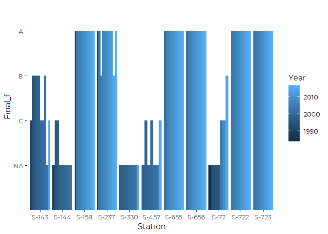
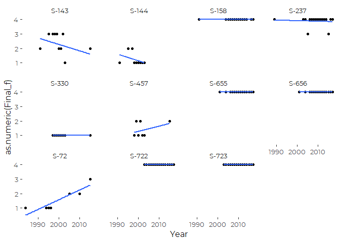
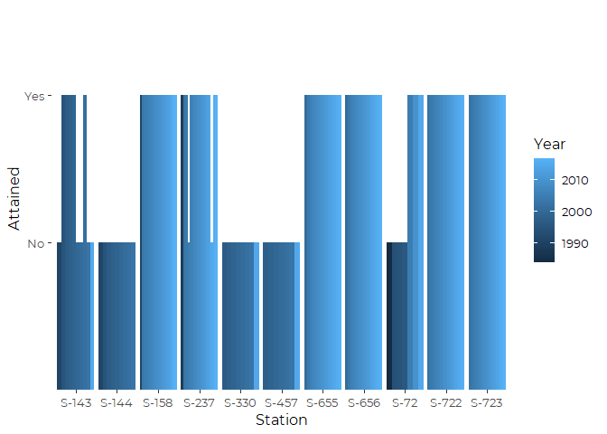
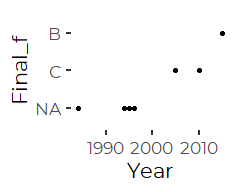
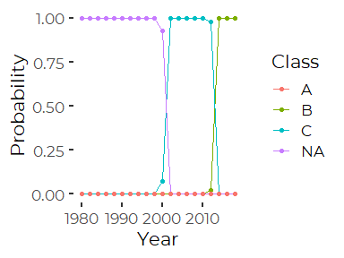
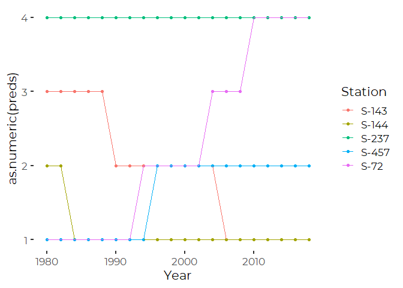
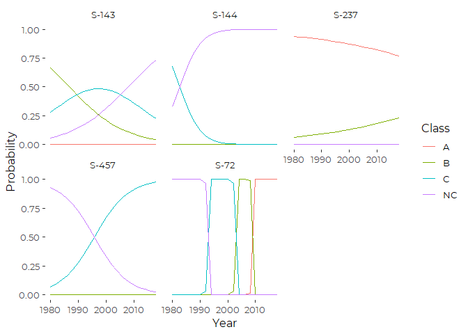

Analysis of Trends at Sites with Multiple Biomonitoring Samples
================
Curtis C. Bohlen, Casco Bay Estuary Partnership
11/19/2020

  - [Introduction](#introduction)
  - [Utility Functions](#utility-functions)
  - [Load Libraries](#load-libraries)
  - [Load Data](#load-data)
      - [Establish Folder References](#establish-folder-references)
      - [Read the Data](#read-the-data)
          - [Primary Sample Data](#primary-sample-data)
          - [Station Data](#station-data)
      - [Create Trend Data](#create-trend-data)
  - [Exploratory Graphics](#exploratory-graphics)
      - [Changes in Achieved Class](#changes-in-achieved-class)
      - [Does the Station Meet Class?](#does-the-station-meet-class)
  - [Example: S-72](#example-s-72)
      - [Data and Graphic](#data-and-graphic)
      - [Initial Model](#initial-model)
      - [Model Results Are Unstable](#model-results-are-unstable)
      - [Predictions](#predictions)
  - [Notes on Model Interpretation](#notes-on-model-interpretation)
      - [Some Theory](#some-theory)
      - [Interpreting Intercepts and
        Coefficients](#interpreting-intercepts-and-coefficients)
  - [Running All Models](#running-all-models)
      - [Example output](#example-output)
      - [Model Summaries](#model-summaries)
      - [Utility function](#utility-function)
      - [Year 2010 Intercepts](#year-2010-intercepts)
      - [Predictions](#predictions-1)
      - [Probabilities](#probabilities)


# Introduction

Maine DEP has developed a robust stream classification model that is
based on collecting stream invertebrates from “rock baskets” left in
streams for about a month. They have also developed methods to assess
water quality based on comments of the algae community.

In this Notebook, we focus on analyzing trends in water quality. The
problem is, sampling Stations do not represent a random sample of
location around the watershed, so it is not necessarily relevant or
appropriate to look at aggregate trends across the region. As a
consequence, we focus on trends at individual stations. The challenge
there is that our principal data is a letter grade (‘A’, ‘B’, ‘C’, ‘NA’)
assigned to each site based on biomonitoring data. We conduct an ordinal
analysis.

We want to be able to say “this site is getting better”, but for
**most** sites, data is too sparse to make any such comparison with
ordinal data. As a result, we need to restrict our attention to the
small number of sites with rich data histories. Still, results are
disappointing. Analysis based on ordinal models requires a fair amount
of data, and while modeling is successful, and informative, none of the
sites show trends that meet conventional standards of statistical
significance, simply because the sample sizes are too small.
Interpreting model results, therefore, is difficult or impossible, and
results of these analyses can not really be incorporated into State of
Casco Bay.

# Utility Functions

``` r
logit <- function(p) {log(p)-log(1-p)}
inv_logit <- function(x) {1/(1+exp(-x))}
```

# Load Libraries

``` r
library(readr)
library(MASS) # for the polr() function
library(Hmisc)
```

    ## Loading required package: lattice

    ## Loading required package: survival

    ## Loading required package: Formula

    ## Loading required package: ggplot2

    ## 
    ## Attaching package: 'Hmisc'

    ## The following objects are masked from 'package:base':
    ## 
    ##     format.pval, units

``` r
library(tidyverse)
```

    ## -- Attaching packages ------------------------------------------------------------------------------------ tidyverse 1.3.0 --

    ## v tibble  3.0.3     v dplyr   1.0.2
    ## v tidyr   1.1.2     v stringr 1.4.0
    ## v purrr   0.3.4     v forcats 0.5.0

    ## -- Conflicts --------------------------------------------------------------------------------------- tidyverse_conflicts() --
    ## x dplyr::filter()    masks stats::filter()
    ## x dplyr::lag()       masks stats::lag()
    ## x dplyr::select()    masks MASS::select()
    ## x dplyr::src()       masks Hmisc::src()
    ## x dplyr::summarize() masks Hmisc::summarize()

``` r
library(emmeans)
```

    ## Warning: package 'emmeans' was built under R version 4.0.3

``` r
library(CBEPgraphics)
load_cbep_fonts()
theme_set(theme_cbep())

library(LCensMeans)
```

# Load Data

## Establish Folder References

``` r
sibfldnm <- 'Derived_Data'
parent   <- dirname(getwd())
sibling  <- file.path(parent,sibfldnm)
fn <- "Biomonitoring_Samples_CB.csv"

# dir.create(file.path(getwd(), 'figures'), showWarnings = FALSE)
```

DEP uses “NA” to indicate “Non Attainment” in the data. By default, R
interprets that as `NA`, meaning missing data. We need to address that
in our code for reading the data. We also need to be careful in later
analyses that R does not drop that value. We considered changing the
data label, but DEP uses “NA” consistently, and for simplicity of
communications it is easiest if we retain the original designation.

**Note that this data contains invertebrate, wetland, and algae sample
data, including sometimes sharing the same site designations.**

## Read the Data

### Primary Sample Data

``` r
the_data <- read_csv(file.path(sibling, fn), na = '') %>%
  rename_with( ~ sub(' Class| Determination| ID', '', .x)) %>%
  rename(Station = `Station Number`,
         Date = `Sample Date`,
         Type = `Sample Type`) %>%
  mutate(Date = as.Date(Date, format = '%m/%d/%Y'),
         Year = as.integer(format(Date, format = '%Y'))) %>%
  relocate(Attained, .after = Final)
```

    ## Parsed with column specification:
    ## cols(
    ##   `Station Number` = col_character(),
    ##   `Sample Type` = col_character(),
    ##   `Sample ID` = col_character(),
    ##   `Sample Date` = col_character(),
    ##   `Statutory Class` = col_character(),
    ##   `Attained Class` = col_character(),
    ##   Report = col_character(),
    ##   `Final Determination` = col_character()
    ## )

### Station Data

``` r
fn <- "Biomonitoring_Stations_CB.csv"
station_data <- read_csv(file.path(sibling, fn), na = '') %>%
select(-contains('FID')) %>%
  select(-Sample_Typ) %>%
  rename(Station_Name = Station,
         Station = Station_Nu,
         Drainage = Major_Drai,
         Imperv = PctImperv)
```

    ## Parsed with column specification:
    ## cols(
    ##   FID = col_double(),
    ##   FID_1 = col_double(),
    ##   Station_Nu = col_character(),
    ##   Station = col_character(),
    ##   Town = col_character(),
    ##   County = col_character(),
    ##   Major_Drai = col_character(),
    ##   Site_Type = col_character(),
    ##   Sample_Typ = col_character(),
    ##   Latitude = col_double(),
    ##   Longitude = col_double(),
    ##   PctImperv = col_double()
    ## )

## Create Trend Data

To conduct analyses of water quality trends, we need enough data to
develop a statistical model. Our ordinal regression models will fit one
less parameter than the number of levels plus how ever many parameters
are needed to fit our linear predictors. So with four levels in our
ordinal response (‘A’. ‘B’, ‘C’, and ‘NA’), we will fit three
intercepts. We can add one more degree of freedom for the Year, for a
total of four degrees of freedom for the model. Detecting any trend,
therefore, is likely to require no less than eight , and probably no
less than ten samples.

to prepare data for trend analysis, we:

1.  Drop indeterminate samples, as they can not fit into an ordinal
    model

2.  Focus only on the invertebrate biomonitoring samples (few Stations
    have long-term algae data sets anyway).

3.  Drop Stations with fewer than a specific number of Samples, here we
    call for a minimum of seven samples (minimum 3 DF for error).

4.  Drop Stations where Samples span less than a minimum number of
    years, here we chose a minimum period of ten years.

<!-- end list -->

``` r
## Set thresholds
minspan = 10   # minimum span of years
mincount = 7   # Minimum number of separate samples

trend_data  <- the_data %>%
  filter(Final != 'I')  %>%
  filter(Type == 'MACROINVERTEBRATE') %>%
  mutate(Final_f = ordered(Final, levels = c('NA', 'C', 'B', 'A'))) %>%
  group_by(Station) %>%
  mutate(n = n(),
         firstyear = min(Year),
         lastyear = max(Year),
         years = lastyear-firstyear) %>%
  ungroup() %>%
  filter (n >= mincount, years >= minspan) %>%
  select( -n, -firstyear, -lastyear, -years) %>%
  select(-Report)
```

Only 11 stations meet our strict criteria for Trend Stations.

``` r
(trend_stations <- unique(trend_data$Station))
```

    ##  [1] "S-72"  "S-143" "S-144" "S-158" "S-237" "S-330" "S-457" "S-655" "S-656"
    ## [10] "S-722" "S-723"

And for most of those, there is no variation in Class (see below). We
can select only those Stations with some variation in observed Class as
follows:

# Exploratory Graphics

### Changes in Achieved Class

``` r
ggplot(trend_data, aes(x = Station, y = Final_f, group = Year, fill = Year)) +
  geom_col(position = position_dodge()) +
  theme_cbep(base_size = 12)
```

<!-- -->

``` r
ggplot(trend_data, aes(x = Year, y = as.numeric(Final_f)) ) +
  facet_wrap(~Station) +
  geom_point() +
  geom_smooth(se = FALSE, method = 'lm') +
  theme_cbep(base_size = 12)
```

    ## `geom_smooth()` using formula 'y ~ x'

<!-- -->

Relatively few Stations show any variation in observations, and even
fewer of them show anything that looks like a trend.

``` r
change_stations <- trend_data %>%
  group_by(Station) %>%
  summarize(has_na = any(is.na(Final)),    # we should not have NAs, but it's worth checking
            count_vals = length(unique(Final)),
            unique_vals = count_vals - has_na,
            sel = unique_vals > 1,
            .groups = 'drop') %>%
  filter(sel) %>%
  pull(Station)

change_stations
```

    ## [1] "S-143" "S-144" "S-237" "S-457" "S-72"

## Does the Station Meet Class?

``` r
ggplot(trend_data, aes(x = Station, y = Attained, group = Year, fill = Year)) +
  geom_col(position = position_dodge())+
  theme_cbep(base_size = 12)
```

<!-- -->

``` r
attained_change_stations <- trend_data %>%
  group_by(Station) %>%
  summarize(has_na = any(is.na(Attained)),    # we should not have NAs, but it's worth checking
            count_vals = length(unique(Attained)),
            unique_vals = count_vals - has_na,
            sel = unique_vals > 1,
            .groups = 'drop') %>%
  filter(sel) %>%
  pull(Station)

attained_change_stations
```

    ## [1] "S-143" "S-237" "S-72"

So, only 5 unique samples with deep sampling histories also show any
variation in observed class, and only 3 changed whether they met class
or did not

We limit our attention to those three or five stations.

``` r
trend_data <- trend_data %>%
  filter(Station %in% change_stations)

attained_data <- trend_data %>%
  filter(Station %in% attained_change_stations)
```

# Example: S-72

Site S-72 shows every indication of a real improvement in water quality,
so we it first to demonstrate methods.

## Data and Graphic

``` r
tmp1 <- trend_data %>%
  filter(Station =="S-72")
```

``` r
ggplot(tmp1, aes(y = Final_f, x = Year)) + geom_point()
```

<!-- -->

## Initial Model

``` r
test1 <- polr(Final_f ~ Year, data = tmp1,
             start=c(0, 1, 2, 3), Hess = TRUE,
             control = list(maxit = 10000))
test1$convergence
```

    ## [1] 0

Unfortunately, polr() does not necessarily tell you if it has trouble
reaching convergence, so it is worth checking the value of the
“convergence” value in the `polr()` result. A value of zero indicates
everything went as expected.

In particular, this model had a hard time reaching convergence
(test1$convergence == 1), so we needed to set a higher iteration limit.
Luckily, these models run fast, so high iteration limits are feasible.

``` r
summary(test1)
```

    ## Call:
    ## polr(formula = Final_f ~ Year, data = tmp1, start = c(0, 1, 2, 
    ##     3), control = list(maxit = 10000), Hess = TRUE)
    ## 
    ## Coefficients:
    ##       Value Std. Error t value
    ## Year 0.8816   0.001833     481
    ## 
    ## Intercepts:
    ##      Value       Std. Error  t value    
    ## NA|C   1763.8868      0.0035 502211.0336
    ## C|B    1774.2007      4.7251    375.4824
    ## B|A    1815.9741      4.7251    384.3231
    ## 
    ## Residual Deviance: 0.5167098 
    ## AIC: 8.51671

Note those very high intercepts. A value that high, in a logit model
should set your teeth on edge. It implies probabilities of one.

``` r
inv_logit(1764)
```

    ## [1] 1

The problem is that `Year` is not centered, and so the intercepts apply
for the Year == 0, wildly outside of our sample range. This is a recipe
(in any regression analysis) for uninterpretable coefficients and
sometimes unstable estimation.

However, for our purposes, it would be interesting to be able to
interpret the intercepts in a simple way. We can handle that by
centering the `Year` predictor, by subtracting a specific (recent;
arbitrary) year. Here we use 2000, as roughly in the middle of the
source data.

``` r
tmp1 <- tmp1 %>% mutate(CYear = Year - 2000)
```

## Model Results Are Unstable

Look what happens if we simply center the year on the year 2000:

``` r
test2 <- polr(Final_f ~ CYear, data = tmp1,
             start=c(0, 1, 2, 3), Hess = TRUE,
             control = list(maxit = 50000))
test2$convergence
```

    ## [1] 0

``` r
summary(test2)
```

    ## Warning in sqrt(diag(vc)): NaNs produced

    ## Call:
    ## polr(formula = Final_f ~ CYear, data = tmp1, start = c(0, 1, 
    ##     2, 3), control = list(maxit = 50000), Hess = TRUE)
    ## 
    ## Coefficients:
    ##       Value Std. Error  t value
    ## CYear 7.792       4802 0.001623
    ## 
    ## Intercepts:
    ##      Value      Std. Error t value   
    ## NA|C     2.5499        NaN        NaN
    ## C|B     97.3754 60972.1774     0.0016
    ## B|A    309.4777 60972.1774     0.0051
    ## 
    ## Residual Deviance: 1.388268e-08 
    ## AIC: 8.00

The intercepts are still large, although not crazy ($p(NC \~ | \~ Year
=2000) $ 0.9275735), The slope for CYEAR is high, and everything has
huge standard errors. Also, the AIC is exactly 8.00, and the residual
deviance is almost precisely zero.

It appears this happens because the sequence of observations can be fit
perfectly by a variety of similar models, leading to very flat profile
curves near the optima.

## Predictions

We can generate predictions from these two alternate models, which are
functionally identical.

``` r
df =tibble(Year = seq(1980,2018,2), CYear = Year - 2000)
(puc <- predict(test1, newdata = df))
```

    ##  [1] NA NA NA NA NA NA NA NA NA NA NA C  C  C  C  C  C  B  B  B 
    ## Levels: NA C B A

``` r
pc  <- predict(test2, newdata = df)
all.equal(pc,puc)
```

    ## [1] TRUE

But we would really like to find the probabilities, not just the final
category.

``` r
pp1 <- predict(test1, newdata = df, type = 'p')

# predict generates an array. we need to convert it.
pp1 <- as_tibble(pp1) %>%
  bind_cols(df) %>%
  relocate(c(Year, CYear)) %>%
  pivot_longer(`NA`:A, names_to = 'Class', values_to = "Probability")

ggplot(pp1, aes(x = Year, y = Probability, color = Class )) +
  geom_line() +
  geom_point()
```

<!-- -->

``` r
pp2 <- predict(test2, newdata = df, type = 'p')

# predict generates an array. we need to convert it.
pp2 <- as_tibble(pp2) %>%
  bind_cols(df) %>%
  relocate(Year) %>%
  pivot_longer(`NA`:A, names_to = 'Class', values_to = "Probability")

ggplot(pp2, aes(x = Year, y = Probability, color = Class )) +
  geom_line() +
  geom_point()
```

<!-- --> BY
Centering the model, we brought the center of the model into the center
of the data, allowing a tighter fit the the data, which here could be
fit exactly, leading to unstable behavior.

# Notes on Model Interpretation

> The following discussion is closely based on a nice treatment of these
> models found here:
> <https://stats.idre.ucla.edu/r/faq/ologit-coefficients/>

## Some Theory

We are modeling an implicit logit model, which is estimating the
probability of “cutpoints” between categories using a generalized linear
model on logits (log odds).

Odds are the probability of an event divided by the probability of its
complement. The odds we are using here represent the odds of being below
a particular threshold, which is the probability of being below the
threshold divided by the probability of NOT being below (i.e., being
above) the threshold:

\[log \frac{P(Y \le j)}{P(Y>j)} = logit (P(Y \le j)).\]

The relevant model looks like this (first row is generic, second
includes the parallel lines assumption; all slopes are the same across
your categories):
\[logit (P(Y \le j)) = \beta_{j0} + \beta_{j1}x_1 + \cdots + \beta_{jp} x_p\\
logit (P(Y \le j)) = \beta_{j0} + \beta_{1}x_1 + \cdots + \beta_{p} x_p.
\] There is one of these equations for each level of the response,`j`
(except for the highest category, where \(P(Y \gt j)\) is zero, so the
odds are undefined.

R’s `polr()` function parameterizes the coefficients in a different way:

\[logit (P(Y \le j)) = \beta_{j0} – \eta_{1}x_1 – \cdots – \eta_{p} x_p\\
\eta_i = -\beta_i.\]

The critical question here is whether the slope is statistically
meaningful or not. Here we see a positive slope, but the associated
standard errors are highly dependent on how we parameterize the year
variable.

## Interpreting Intercepts and Coefficients

``` r
coefficients(summary(test2))
```

    ## Warning in sqrt(diag(vc)): NaNs produced

    ##            Value Std. Error     t value
    ## CYear   7.791649   4801.821 0.001622645
    ## NA|C    2.549916        NaN         NaN
    ## C|B    97.375416  60972.177 0.001597047
    ## B|A   309.477682  60972.177 0.005075720

How do we interpret the coefficients? Think in terms of a latent
binomial model for each “hidden” threshold. The three models are linked
together by the parallel lines assumption (and calculation of common
deviance) but otherwise, each could stand alone as a binomial model. \[
logit (P(NC | CYear = x)) = logit (P(Y \le j_{NC} | Year = x)) = \beta_{(NC)0} – \eta_{1} \times CYear \\
logit (P(C | CYear = x)) = logit (P(Y \le j_{C}| Year = x)) = \beta_{(C)0} – \eta_{1} \times CYear \\
logit (P(B | CYear = x)) = logit (P(Y \le j_{B} | Year = x)) = \beta_{(B)0} – \eta_{1} \times CYear
\]

\[
logit (P(NC | Year = x)) = 2.55 -(7.79) \times CYear \\
logit (P(C | Year = x)) = 97.4 -(7.79) \times CYear  \\
logit (P(B | Year = x)) = 309.5 -(7.79) \times CYear 
\]

So, the Probability, in 2000, (\(CYEAR = 0\)) of

1.  being NA (i.e., being below the threshold for Class C),

2.  being Class C (i.e., below the threshold for class B) or

3.  Class B (Below the level for A)

are as follows:

``` r
round(inv_logit(c(2.55, 97.4, 309.5)),3)
```

    ## [1] 0.928 1.000 1.000

That is, there is only a small basis to hope for good water quality at
this site in the year 2000.

if we “fast forward” a few years to 2010, we’d get :

``` r
round(inv_logit(c(2.55-7.79*10, 97.4-7.79*10, 309.5-7.79*10)),3)
```

    ## [1] 0 1 1

So, to within rounding error, we’re getting class C. (All the
probability mass is higher than the threshold to Class C, but Lower than
the Threshold to Class B).

We can also ask if the slope is significant, but here we have a problem
caused by the monster standard errors on the parameters. The trend
appears meaningful, but there is no simple strategy to test the slope. A
bootstrap of some sort might work, but the small sample size means
results would not be convincing.

# Running All Models

So, we can apply a similar strategy to all Stations simultaneously. Here
we use a more recent year to center our regression models, choosing to
center the models at 2010.

``` r
mods <- trend_data %>%
  mutate(CYear = Year - 2010) %>%
  group_by(Station) %>%
  nest() %>%
  mutate(sample =  map_dbl(data, nrow)) %>%
  mutate(mcyear = map(data, function(df) polr(Final_f ~ CYear,
                                              start = c(.1, .2, .3, 1),
                                              data = df, Hess = TRUE,
                                              control = list(maxit = 50000))))
```

## Example output

``` r
mods$Station[[1]]
```

    ## [1] "S-72"

``` r
mods$mcyear[[1]]
```

    ## Call:
    ## polr(formula = Final_f ~ CYear, data = df, start = c(0.1, 0.2, 
    ##     0.3, 1), control = list(maxit = 50000), Hess = TRUE)
    ## 
    ## Coefficients:
    ##    CYear 
    ## 6.823056 
    ## 
    ## Intercepts:
    ##      NA|C       C|B       B|A 
    ## -51.19953  17.06242  59.03461 
    ## 
    ## Residual Deviance: 2.324628e-07 
    ## AIC: 8.00

``` r
summary(mods$mcyear[[1]])
```

    ## Call:
    ## polr(formula = Final_f ~ CYear, data = df, start = c(0.1, 0.2, 
    ##     0.3, 1), control = list(maxit = 50000), Hess = TRUE)
    ## 
    ## Coefficients:
    ##       Value Std. Error t value
    ## CYear 6.823       1430 0.00477
    ## 
    ## Intercepts:
    ##      Value       Std. Error  t value    
    ## NA|C    -51.1995   8798.0508     -0.0058
    ## C|B      17.0624   5065.4365      0.0034
    ## B|A      59.0346 260921.8305      0.0002
    ## 
    ## Residual Deviance: 2.324628e-07 
    ## AIC: 8.00

We see again the huge standard errors.

``` r
round(inv_logit(coef(summary(mods$mcyear[[1]]))[,'Value']),3)
```

    ## CYear  NA|C   C|B   B|A 
    ## 0.999 0.000 1.000 1.000

These values are the “probabilities” of being below a particular cut
point, as we saw before.

## Model Summaries

``` r
names(mods$mcyear) <-  mods$Station
map(mods$mcyear, summary)
```

    ## $`S-72`
    ## Call:
    ## polr(formula = Final_f ~ CYear, data = df, start = c(0.1, 0.2, 
    ##     0.3, 1), control = list(maxit = 50000), Hess = TRUE)
    ## 
    ## Coefficients:
    ##       Value Std. Error t value
    ## CYear 6.823       1430 0.00477
    ## 
    ## Intercepts:
    ##      Value       Std. Error  t value    
    ## NA|C    -51.1995   8798.0508     -0.0058
    ## C|B      17.0624   5065.4365      0.0034
    ## B|A      59.0346 260921.8305      0.0002
    ## 
    ## Residual Deviance: 2.324628e-07 
    ## AIC: 8.00 
    ## 
    ## $`S-143`
    ## Call:
    ## polr(formula = Final_f ~ CYear, data = df, start = c(0.1, 0.2, 
    ##     0.3, 1), control = list(maxit = 50000), Hess = TRUE)
    ## 
    ## Coefficients:
    ##         Value Std. Error t value
    ## CYear -0.1001    0.09576  -1.045
    ## 
    ## Intercepts:
    ##      Value    Std. Error t value 
    ## NA|C  -0.7898   1.0795    -0.7316
    ## C|B    1.3250   1.1376     1.1647
    ## B|A   13.7025 165.3628     0.0829
    ## 
    ## Residual Deviance: 23.48387 
    ## AIC: 31.48387 
    ## 
    ## $`S-144`
    ## Call:
    ## polr(formula = Final_f ~ CYear, data = df, start = c(0.1, 0.2, 
    ##     0.3, 1), control = list(maxit = 50000), Hess = TRUE)
    ## 
    ## Coefficients:
    ##         Value Std. Error t value
    ## CYear -0.2693     0.2384  -1.129
    ## 
    ## Intercepts:
    ##      Value     Std. Error t value  
    ## NA|C    4.6594    3.1766     1.4668
    ## C|B  1081.6304    3.1766   340.5027
    ## B|A  1082.3304    3.1766   340.7230
    ## 
    ## Residual Deviance: 8.572075 
    ## AIC: 16.57207 
    ## 
    ## $`S-237`
    ## Call:
    ## polr(formula = Final_f ~ CYear, data = df, start = c(0.1, 0.2, 
    ##     0.3, 1), control = list(maxit = 50000), Hess = TRUE)
    ## 
    ## Coefficients:
    ##          Value Std. Error t value
    ## CYear -0.03996     0.1333 -0.2998
    ## 
    ## Intercepts:
    ##      Value    Std. Error t value 
    ## NA|C -10.1809  40.6839    -0.2502
    ## C|B  -10.1291  39.6937    -0.2552
    ## B|A   -1.9174   0.7583    -2.5286
    ## 
    ## Residual Deviance: 11.95822 
    ## AIC: 19.95822 
    ## 
    ## $`S-457`
    ## Call:
    ## polr(formula = Final_f ~ CYear, data = df, start = c(0.1, 0.2, 
    ##     0.3, 1), control = list(maxit = 50000), Hess = TRUE)
    ## 
    ## Coefficients:
    ##       Value Std. Error t value
    ## CYear 0.166     0.1815  0.9145
    ## 
    ## Intercepts:
    ##      Value         Std. Error    t value      
    ## NA|C -7.050000e-01  1.600100e+00 -4.406000e-01
    ## C|B   7.083389e+13  1.600100e+00  4.426884e+13
    ## B|A   7.083389e+13  1.600100e+00  4.426884e+13
    ## 
    ## Residual Deviance: 9.483206 
    ## AIC: 17.48321

None of those have T values that suggest statistically significant
slopes, so this whole analytic strategy is apparently not very
informative.

## Utility function

``` r
pull_probs <- function(m) {round(inv_logit(coef(summary(m))[,'Value']),3)}
```

## Year 2010 Intercepts

``` r
mm <- map(mods$mcyear, pull_probs)

for (row in 1:length(mods$Station)) {
  print(c(mods$Station[row], mm[[row]][2],
                                     mm[[row]][3],
                                     mm[[row]][4]))
}
```

    ##          NA|C    C|B    B|A 
    ## "S-72"    "0"    "1"    "1" 
    ##            NA|C     C|B     B|A 
    ## "S-143" "0.312"  "0.79"     "1" 
    ##            NA|C     C|B     B|A 
    ## "S-144" "0.991"     "1"     "1" 
    ##            NA|C     C|B     B|A 
    ## "S-237"     "0"     "0" "0.128" 
    ##            NA|C     C|B     B|A 
    ## "S-457" "0.331"     "1"     "1"

## Predictions

``` r
mods <- mods %>%
  mutate(preds = map(mcyear, function(m) predict(m, newdata = df)))
```

``` r
preds <- mods %>%
  select (Station, preds) %>%
  unnest(cols = c(preds)) %>%
  ungroup() %>%
  mutate(Year = rep(df$Year, length(change_stations)))
```

``` r
ggplot(preds, aes(Year, as.numeric(preds), color = Station)) +
  geom_point() +
  geom_line()
```

<!-- -->

## Probabilities

``` r
mods <- mods %>%
  mutate(probs = map(mcyear, function(m) predict(m, newdata = df, type = 'p')))
```

``` r
probs <- mods %>%
  select (Station, probs) %>%
  unnest(cols = c(probs)) %>%
  ungroup() %>%
  mutate(Year = rep(df$Year, length(change_stations))) %>%
  mutate(pNC = probs[,1],
         pC = probs[,2],
         pB = probs[,3],
         pA = probs[,4]) %>%
  select(-probs) %>%
  pivot_longer(contains('p'), names_to = 'Class', values_to = 'Probability') %>%
  mutate(Class = substr(Class, 2,nchar(Class)))
```

``` r
ggplot(probs, aes(x = Year, y = Probability, color = Class)) +
  facet_wrap(~Station) +
  geom_line() +
  theme_cbep(base_size = 12)
```

<!-- -->
